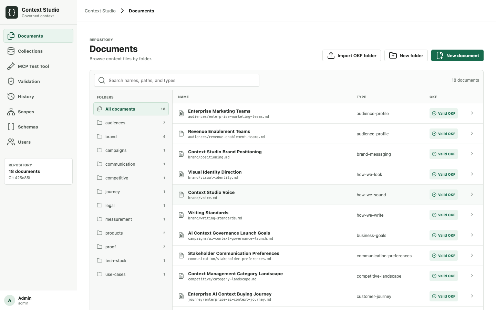
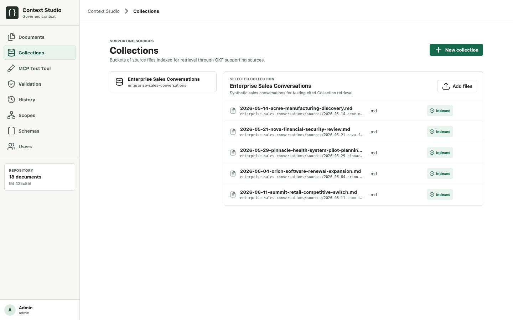
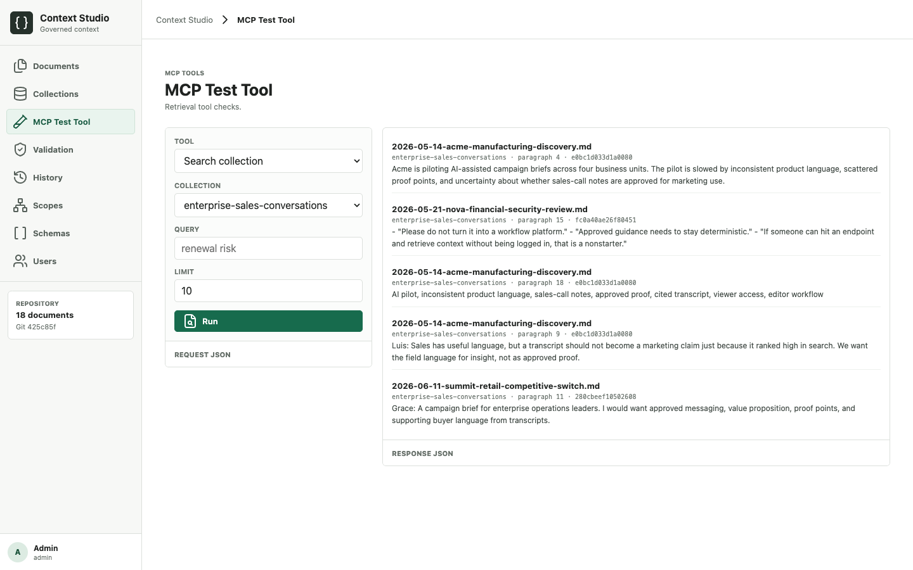

# Context Studio

Context Studio is a file-based context CMS for governed marketing Documents plus searchable supporting Collections. Astro provides the CMS interface. FastAPI and Pydantic handle authentication, filesystem operations, OKF validation, scoped retrieval, Git history, Collection indexing, and MCP access. FastMCP exposes valid context to AI tools.

## Guiding Documents

- [MARKETING_CONTEXT_GUIDE.md](MARKETING_CONTEXT_GUIDE.md) guides how marketing context should be structured, governed, retrieved, and separated from skills and outcome specs.
- [GOVERNANCE.md](GOVERNANCE.md) defines repository guardrails, OKF usage, scope inheritance, retrieval rules, and Collection boundaries.

## Demo Repository

The included `context_repo/` is synthetic. It contains governed marketing Documents for the Context Studio demo brand, including audience profiles, brand messaging, product facts, value proposition, proof points, journey, competitive landscape, legal guardrails, measurement, tech stack, use cases, and communication preferences.

The local demo Collection `enterprise-sales-conversations` can be seeded from `sample_sources/sales-conversations/`. These transcripts are synthetic supporting sources for testing cited Collection retrieval.

## Screenshots

Screenshots are generated from the local demo app and stored in `docs/screenshots/`.

### Documents



### Collections



### MCP Test Tool



## What It Does

- Stores Markdown OKF records and JSON source files in `context_repo/`
- Uses local Git for commits, history, diffs, restores, and deletes
- Supports folder-level metadata inherited by documents
- Lets document frontmatter override folder metadata
- Validates documents for OKF and governance rules
- Provides Raw, Preview, and Split document views
- Imports OKF folders into `context_repo/`
- Stores supporting source files in Collections
- Indexes Collection passages with SQLite FTS5 and a local deterministic embedding vector
- Returns cited Collection passages for hybrid and flexible context when routed by OKF supporting sources
- Provides an MCP Test Tool for calling the same service methods used by MCP tools
- Exposes MCP tools at `/mcp/`
- Supports local demo users or GitHub-backed access control

## Storage

The project is one Git repository. CMS writes commit only the changed paths under `context_repo/`. In local mode, commits stay local. In GitHub mode, we sync from `origin` on startup, pull with `--ff-only` before a write, commit the changed path, and push back to the current branch.

Governance resolves in this order:

1. `context_repo/_schema.yaml`
2. Each nested folder's `_schema.yaml`
3. The document's YAML frontmatter

Later values override earlier values. Every concept document must still contain its own OKF `type` field.

`context_repo/_scopes.yaml` stores the parent-linked scope hierarchy. Documents use a `scope_id`; context retrieval inherits from parent scopes and prefers the most specific matching records.

CMS creation and editing actions use right-side drawers. Documents can be added, edited, deleted, restored, and inspected through Git history. Folders can be added and deleted when empty. Admins can edit users, scopes, folder metadata schemas, folders, documents, imports, and Collections. Editors can edit Folders, Documents, and Collections. Viewers can review and request context. In GitHub mode, user access is managed in GitHub repository settings.

Markdown files are validated as OKF records. JSON files are supported as structured source documents. Both formats provide Raw, Preview, and Split editor modes. Representative case study, competitive, and ICP examples live under `context_repo/examples/`.

## Context Model

The project separates curated context from supporting source material.

- **Documents** are OKF records in `context_repo/`. They are retrieved deterministically by fields like `type`, `scope_id`, `status`, `criticality`, and `valid_until`.
- **Collections** are local buckets of source files under `var/collections/`. They store original source documents and indexed retrieval units. They are not OKF records.
- **MCP Test Tool** calls the same service methods used by MCP tools.

OKF records are never retrieved with semantic embeddings. Collection retrieval is available only when a matching OKF document or inherited folder schema points to that Collection through `supporting_sources.collections`.

Supporting source shape:

```yaml
supporting_sources:
  collections:
    - collection-1
  web:
    - https://example.com/page
  mcp:
    - sales-calls
```

Controlled context ignores supporting sources. Hybrid and flexible context can include approved OKF records, cited Collection passages, and suggested web/MCP sources.

## Run Locally

Terminal 1:

```bash
uv sync
uv run python run.py serve --port 8001
```

Terminal 2:

```bash
cd cms
npm install
npm run dev
```

Open `http://127.0.0.1:4321`.

Default local users are configured in `config.json` and used when GitHub mode is not configured:

- `admin` / `admin123`
- `editor` / `editor123`
- `viewer` / `viewer123`

## GitHub access mode

GitHub can be the access-control source for a hosted CMS. Users sign in with GitHub, and the API checks their permission on the configured repository:

```text
GET /repos/{owner}/{repo}/collaborators/{username}/permission
```

Access maps directly from GitHub:

- `admin` -> CMS admin
- `write` or `maintain` -> CMS editor
- `read` or `triage` -> CMS viewer
- `none` or no collaborator record -> no CMS access

In GitHub mode, all git-backed write actions verify the user's current GitHub permission before saving. Repository admins can edit scopes, folder metadata schemas, imports, and content in the app, while user access is managed in GitHub. GitHub users with `write` or `maintain` access can edit Folders, Documents, and Collections. GitHub users with `read` or `triage` access can review and request context.

Set these environment variables before starting the FastAPI service:

```bash
export CS_GITHUB_OWNER=jroakes
export CS_GITHUB_REPO=context-system-prototype-codex
export CS_GITHUB_CLIENT_ID=...
export CS_GITHUB_CLIENT_SECRET=...
export CS_PUBLIC_APP_URL=http://127.0.0.1:4321
```

The GitHub OAuth callback URL should point to the FastAPI server:

```text
http://127.0.0.1:8001/api/auth/github/callback
```

When those variables are present, the login screen switches to GitHub sign-in and the local Users screen is hidden.

## Deploying

Deploy the CMS and API behind the same public origin. The Astro app calls relative `/api/*` and `/mcp/*` paths, so either serve `cms/dist` and proxy those paths to FastAPI from one domain, or put both behind a gateway that preserves same-origin cookies.

1. Prepare the server:

```bash
git clone https://github.com/jroakes/context-system-prototype-codex.git
cd context-system-prototype-codex
uv sync
cd cms && npm install && npm run build && cd ..
uv run python run.py validate
```

2. Configure persistent storage for:

- `context_repo/`, the Git-backed OKF working copy
- `var/users.sqlite`, local sessions and local demo users when GitHub mode is disabled
- `var/audit.sqlite`, controlled-context audit events
- `var/collections/` and `var/collections.sqlite`, Collection source files and indexes

3. Set production environment variables before starting FastAPI:

```bash
export CS_SECRET_KEY=replace-with-a-long-random-value
export CS_PUBLIC_APP_URL=https://your-context-app.example.com
export CS_CONTEXT_REPOSITORY_PATH=/persistent/context_repo
export CS_USERS_PATH=/persistent/var/users.sqlite
export CS_AUDIT_PATH=/persistent/var/audit.sqlite
export CS_COLLECTIONS_ROOT_PATH=/persistent/var/collections
export CS_COLLECTIONS_DB_PATH=/persistent/var/collections.sqlite
```

For GitHub login and Git-backed production editing, also set:

```bash
export CS_GITHUB_OWNER=jroakes
export CS_GITHUB_REPO=context-system-prototype-codex
export CS_GITHUB_CLIENT_ID=...
export CS_GITHUB_CLIENT_SECRET=...
```

The GitHub OAuth callback URL should be:

```text
https://your-context-app.example.com/api/auth/github/callback
```

4. Run the backend service:

```bash
uv run python run.py serve --port 8001
```

Use a process manager for production, and proxy:

- `/api/*` -> `http://127.0.0.1:8001/api/*`
- `/mcp/*` -> `http://127.0.0.1:8001/mcp/*`
- all other paths -> static files from `cms/dist`

5. Verify the deployment:

```bash
curl https://your-context-app.example.com/api/health
uv run python run.py validate
```

Then sign in through the public URL and run an MCP Test Tool request. In GitHub mode, users must be collaborators on the configured repository; repository `admin` maps to Admin, `write` or `maintain` maps to Editor, and `read` or `triage` maps to Viewer.

If GitHub mode is enabled, make sure the deployed working copy has an `origin` remote and Git credentials that can pull and push the configured branch. Writes use direct commits, pull with `--ff-only` before saving, and push after each successful Git-backed write.

## MCP

The streamable HTTP MCP URL is `http://127.0.0.1:8001/mcp/`. MCP access requires a valid local or GitHub login. Available tools list context scopes, types, folders, indexes, logs, and metadata-only Documents; read full Documents; search surfaced Collections; read Collection sources; and validate the bundle.

## API Highlights

- `POST /api/mcp-tools/{tool_name}` runs an authenticated MCP Test Tool request through the same service methods used by MCP tools.
- `POST /api/imports/okf-folder/scan` scans an OKF folder before import.
- `POST /api/imports/okf-folder/apply` imports an OKF folder as one Git-backed operation.
- `GET /api/collections` lists Collections.
- `POST /api/collections` creates a Collection with only ID, name, and description.
- `POST /api/collections/{collection_id}/documents` stores and indexes a source document.

## CLI

```bash
uv run python run.py validate
uv run python run.py stats
uv run python run.py serve --port 8001
```

## Tests

```bash
uv run pytest
cd cms && npm run build
```
